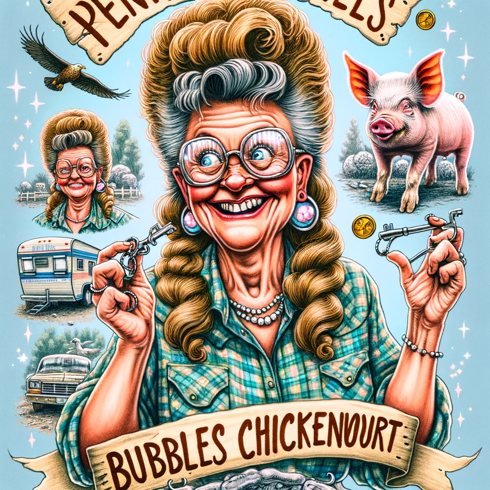
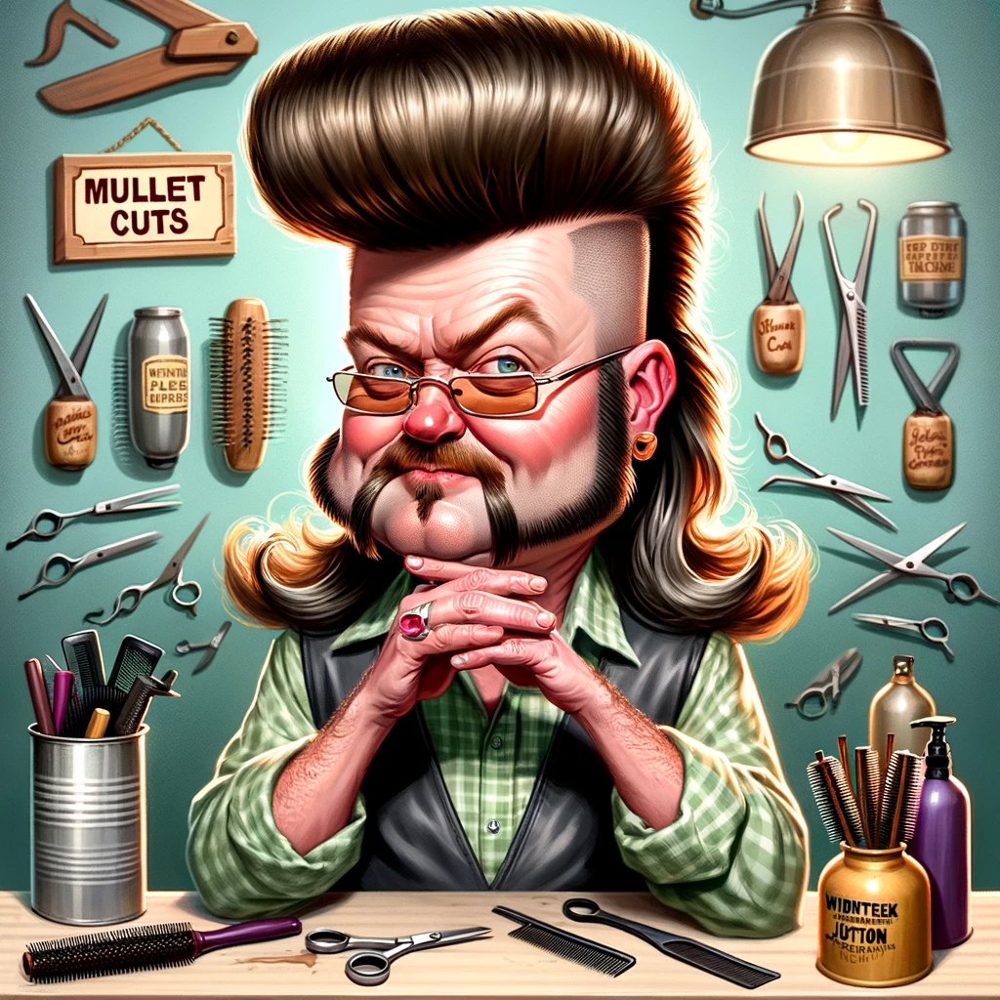
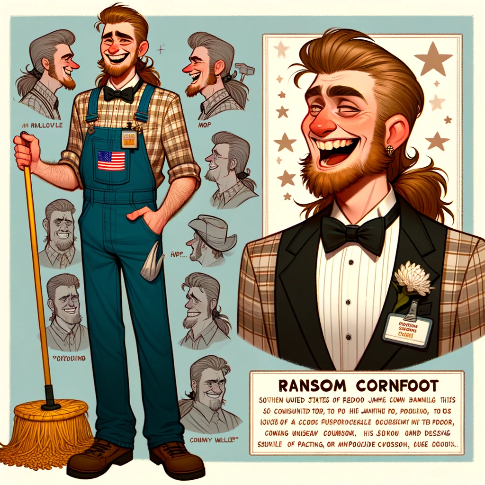

# MURDER, MAYHEM, & MULLETS
## SYNOPSIS
                  
Henpecked Junction is a small, charming town chock full of the best trailer parks with the most offbeat, neighborly, and, well, troublemaking residents. 
The festival planners have spewed blood, sweat, and bacon grease to make this year's Mullet Fest the most extraordinary jubilee ever thrown in the town square. 
Everyone's chompin’ at the bit to party this year, as Henpecked Junction recently received national recognition for bringing home a record number of winnin' titles, such as the Mullet of the Year Award, Muds & Suds Truck Race, Rompin', Stompin' Hot Dog Chomp - and the list goes on.
But the mayor's feelin’ like a long-tailed cat in a room of rockin’ chairs about how the townies will behave. 
Last year, the festival had to shut down before sundown due to excessive table divin', portable potty vandalism, among other wrongdoings. 
So hopefully, everyone will be on their best behavior. 
Well, hmm, that bar ain't too high, if ya know what I'm sayin.
But can't never could do nothing, so the show will go on as planned.
I saw that you snagged your ticket to Mullet Fest, and I know you can't wait to see what all's being fried up for the food offerings.

## Boo Boo Bonefat, Mayor of Henpecked Junction (Nick Dufek)
### Trailer Park: Fall Pines, Lot 5 
### Cancer - Birthday: July 12
### Boo Boo's protectiveness of animals and their gift for storytelling are typical of Cancers. They are nurturing and sentimental individuals.
Boo-Boo Bonefat has been the residing mayor of Henpecked Junction for almost a decade. 
Boo-Boo despises change of any kind and manages the town with questionable practices. 
Boo-Boo will make up words to make your brain spin while gazing into your eyes with unreadable facial expressions. 
A severe hypochondriac, don't get the sniffles around Boo-Boo, or you'll throw this politician into a freak-out fit.
The mayor often scribbles things in a small notebook, but many people want to know why. 
Boo-Boo is freakishly organized, which enhances their deductive reasoning skills. 
The mayor is also the town's protector of animals and a rather gifted storyteller.

## Dimples Clementine, Reality Star (Christina Dufek)
### Trailer Park: Spring Meadows, Lot 52
### Taurus - Birthday: May 5
### Dimples' steadfastness and tendency not to admit fault align with Taurus traits
Dimples Clementine is a barista-turned-reality star on the hit television show Maw Maw Pearl & Me by the Cowlick Network.
Dimples is massively superstitious, a constant lip licker, and could not admit fault to save their life. 
Everyone knows that Dimples tries to pass off regular clothing as designer attire, but the fake emblems Dimples makes are far too transparent. 
Dimples is always carrying a massive bag, and most of the time —it's empty. 
That's because this TV star steals everything not bolted down that can fit in the bag. 
But Dimples is one of the most patient and calm folks ever to be around and is the first to see the good in others — even if it costs them.

## Jem Rock, Mobile DJ (Christian Steiner)
### Trailer Park: Spring Meadows, Lot 53 
### Aquarius - Birthday: January 17
### Jem's desire to keep up with the Joneses and aspirations to leave Henpecked Junction align with Aquarius' independent and forward-thinking nature.
Jem Rock is the sassy gum-smacking DJ-for-hire. 
Jem prefers heavy metal music, and it's rare to find this record spinner without the signature black attire from head to toe.
The doc's warned this music spewer to cut back on the three cases of root beer poured down Jem's gullet each weekend, but Jem makes it a point to eat an apple every day to avoid having to go back for checkups. 
Jem took home the US Mullet Championship for three straight years, but Coors McFadden snagged the title this year and has put Jem into a foul mood for the most part.
Jem is always trying to keep up with the Joneses and will spend every last penny on the best of anything just for bragging rights. 
Jem has great aspirations for the DJ business and doesn't plan to stay in Henpecked Junction for much longer. 
This DJ is a loyal friend for life and would never give up on those closest to them — but might betray someone if the stars were aligned exactly right.

## Bubbles Chickenwort, Pig Farmer (Marie Steiner)
### Trailer Park: Winter Hills, Lot 16
### Cancer - Birthday: July 10 
### Bubbles' desire for adventure and frequent flakiness might be influenced by Cancer's changeable nature.
Bubbles Chickenwort has recently created a pig farm on the costume outskirts of Henpecked Junction. 
Bubbles still resides in the Winter Hills Trailer Park and scoots over to the farm each day at sunrise.
This hiccupping farmer is a constant key and coin jingler who wears massive eyeglasses and speaks to themselves in public. 
In addition, Bubbles is always searching for the next adventure and an excuse to have fun. 
But don't make plans too far out with this piggie leader, as Bubbles is likely to flake and stand you up. 
Teachers throughout the earlier school years referred Bubbles to the a mullet by gifted and talented programs. 
However, Bubbles fell out of sorts with academia by ninth grade and struggled through the next three years until graduation. 
Bubbles had always wanted to raise animals as an occupation, and pigs just seemed right.

## Crash P. Coltrane, Hair Tamer (George Butz)
### Trailer Park: Winter Hills, Lot 14 
### Leo - Birthday: August 19
### Crash's expressive personality and desire for recognition align with Leo traits.
Crash P. Coltrane is the chief hair tamer at Mullet Cuts — the only hair salon in Henpecked Junction. 
Crash taps their chin while thinking and is severely introverted. 
It's a wonder they chose a profession dealing with the public. 
This scissor master takes everything personally and is overly expressive, which can be confusing during chats. 
Therefore, most people bring earbuds to their hair appointments.
Crash is notorious for stealing credit for anything good that happens and has an annoying habit of sniffing everything within reach.
Funny enough, Crash tries to hide their 145 IQ. 
Crash may be the most brilliant resident of Henpecked Junction, but you'd never know that.

## Lipton Dittybopper, Online Retail Shop Owner (Mandy Butz)
### Trailer Park: Summer Gardens, Lot 11
### Libra - Birthday: October 22
### Lipton's obsession with pop culture and judgmental tendencies might be linked to Libra's love for aesthetics and balance.
Lipton Dittybopper owns the online shop on Eggsy called The Redneckery — a handmade jewelry shop selling quirky jewelry from trash Lipton finds on the street, such as soda can tops, candy wrappers, cigarette butts, and more.
Lipton trusts everyone, is obsessed with pop culture, and is a rabid but fake vegan. 
Lipton can be highly judgmental and will insult others out of earshot.
Lipton once saved a kitten from the top of a tree, and it somehow made national news. 
But of course, you get to hear about it every time you see Lipton — who never misses a trivia night at the Rebel Yell Waterin’ Hole.

## Gator Daniels, Mailman (Richard Thomas)
### Trailer Park: Fall Pines, Lot 7 
### Aries - Birthday: April 1
### Gator's outgoing and impulsive nature is typical of an Aries.
Gator Daniels is the lovable, outgoing mailperson of Henpecked Junction.
With the tiny post office having three employees, Gator is the only one delivering mail to the town. 
Gator refueses to plan anything, so this mail jockey is about impulse decisions.
Gator doesn't live in the past and is ambitious about the future.
Gator speaks as if asking a question but would never give anyone credit for knowing something that they didn't.
Gator's a know-it-all and loves to claim a willing ear to listen to their accomplishments.
This mailperson isn't all about themeselves, though. 
Gator is the town's humanitarian and is the only one who makes an effort to put on charitable events.

## Clydetta Ruffnap, Professional Fake Friend (Kirsten Thomas)
### Trailer Park: Summer Gardens, Lot 4 
### Virgo - Birthday: August 31
### Clydetta's need to have the last word and being easily influenced may be connected to Virgo's meticulous and analytical nature.
If you ever need bodies to fill seats and pretend friends, call upon Clydetta. 
Ms. Ruffnap works as a professional fake friend for weddings, funerals, class reunions, and more. 
Clydetta usually travels outside Henpecked Junction for work, so she must leave her home unattended at the Summer Gardens Trailer Park.
Unfortunately, this has caused her a few problems with the local kids vandalizing her property.
During conversations, Clydetta injects weird pauses mid-sentence and must always have the last word. 
But she is super easy to influence if you need someone to agree or take your side. 
In addition, Clydetta is enthusiastic about life and has become fluent in eight languages.

## Sweetpea Eversnot, Private Detective (Lyndsey Gibbons)
### Trailer Park: Spring Meadows, Lot 25 
### Capricorn - Birthday: December 24
### Sweatpea's suspicion and social deduction skills may be influenced by Capricorn's practicality and determination.
The always-starving private detective of Henpecked Junction is named Sweatpea Eversnot. 
This PI is suspicious of everyone and everything and has impeccable skills with social deduction.
Sweatpea expects undying loyalty from everyone.
Unfortunately, this detective isn't loyal to anyone.
During group chats, Sweatpea will answer for people by figuring out what they'd say by context clues.
This practice tends to irritate others, but they all would agree that Sweetpea hits the nail on the head everytime.
So, there is no better sleuth for miles, and Sweetpea will get the job if a pet is missing, a friend or business associate is suspected of disloyalty, or maybe someone wants to track down a relative who's left town.
Detective eversnot will go to the ends of the Earth to solve the case.

## Skipper Clampetts, Fast Food Chef (Sean Gibbons)
### Trailer Park: Summer Gardens, Lot 14
### Aquarius - Birthday: February 9
### Skipper's attention to hygiene and tendency to seek flattery match Aquarius' independent and forward-thinking nature.
Skipper Clampetts is the head chef at the Angry Rooster — the most popular fast-food establishment in Henpecked Junction. 
Skipper’s known to be reactive and dramatic so working for this spatula-wielder can be taxing.
Skipper is forgetful but surprisingly has a crystal-clear memory of being the regional dodgeball champion and MVP for Henpecked High in high school. 
Skipper will always seek out flattery as this chefs super clean and pays close attention to hygiene. 
But Skipper doesn’t judge others and is a loyal and dedicated friend.

## Cletus Bottums, Taxi Driver (Kurt Gibbons)
### Trailer Park: Summer Gardens, Lot 13 
### Gemini - Birthday: June 7
### Cletus' love for games and the ability to adapt to different situations are characteristic of Geminis.
Cletus Bottums runs the only taxi service in town — "I'll Get Ya There". 
Cletus spends most evenings shuttling the residents of the four trailer parks in town to the "Rebel Yell Waterin' Hole" or the "Spotted Stag Dance Hall". 
Cletus loves to play games and often leaves notes for others to find. 
When challenged, he can be pretty passive-aggressive and will call his mother for advice.
Also, this shuttler will walk away from conversations without losing eye contact, which is bizarre.
An incredibly talented musician, Cletus was a child prodigy who picked up his daddy's guitar as a tot and never looked back. 
There isn't a song that Cletus can't strum. 
So, to no surprise, Cletus is working on his first album. 
Nevertheless, it's been in the making for almost ten years now.

## Ransom Cornfoot, Janitor (Mike Martinson)
### Trailer Park: Winter Hills, Lot 20
### Taurus - Birthday: April 30
### Ransom's constant pacing and polite nature align with Taurus' practical and determined qualities.
Ransom Cornfoot has never heard an unfunny joke, as this janitor is always cackling.
But Ransom’s got a laugh you'll always remember.
It's potentially the most obnoxious snort-filled chuckle-giggles your ears have ever consumed.
Ransom is a free-lanes janitor contracted to clean up the high school, city hall, and a few other businesses in Henpecked Junction. 
This mop wielder is constantly pacing and worried about something.
But Ransom is polite and is one to tuck a napkin in their shirt even if only drinking soda pop. 
A thoughtful gift giver, Ransom is a dear friend to have. 
But, unfortunately, this clean freak never dresses appropriately for any occasion or weather. 
For example, if you have a wedding in the summer — you better bet Ransom is showing up in overalls and a parka but will wear a short-sleeved tux to a crawfish boil in January.

## Darleen Pringles, Waitress (Karen Martinson)
### Trailer Park: Winter Hills, Lot 3
### Aquarius - Birthday: February 3
### Darleen's fussy eating habits and desire for approval may be connected to Aquarius' independent and forward-thinking qualities.
Darleen Prangles is the head waitress at Breakfast Served Any Time — the central gathering spot of Henpecked Junction. 
Because she smells food all day, Darleen is one fussy eater who must comment on others food choices - all while avoiding eye contact. 
Darleen seeks approval from others and is a fantastic cook. 
She recently received an acceptance letter from a top culinary school in New York City — Culinary Master Academy. 
The townies have poked fun of her for wanting to be a city slicker, but Darleen aspires to land a job in the kitchen of a famous restaurant in the big city after graduating from school.

# Trailer Parks Arrangement:
## Fall Pines (Lots 1, 5, 7, 8): 
Located to the north of the town square, a forested area with autumn-themed decorations.
### Boo Boo Bonefat (Mayor)
### Gator Daniels (Mailman)

## Summer Gardens (Lots 4, 11, 13, 14): 
Situated to the east, featuring lush greenery and floral arrangements.
### Lipton Dittybopper (Online Retail Shop Owner)
### Clydetta Ruffnap (Professional Fake Friend)
### Skipper Clampetts (Fast Food Chef)
### Cletus Bottums (Taxi Driver)

## Spring Meadows (Lots 25, 52, 53): 
To the south, characterized by open fields and blooming flowers.
### Dimples Clementine (Reality Star)
### Jem Rock (Mobile DJ)
### Sweetpea Eversnot (Private Detective)

## Winter Hills (Lots 2, 3, 14, 16, 20): 
Positioned to the west, with a hillier terrain and wintery themes.
### Bubbles Chickenwort (Pig Farmer)
### Crash P. Coltrane (Hair Tamer)
### Ransom Cornfoot (Janitor)
### Darleen Pringles (Waitress)

## Character Connections and Daily Activities:
### Boo Boo Bonefat: Likely to be at City Hall, managing town affairs, or at the Fall Pines Trailer Park. May also be found preparing for the Mullet Fest at the Town Square.
### Dimples Clementine: Possibly working on the set of their reality show or shopping (perhaps surreptitiously adding to their massive bag). Could be seen socializing at Spring Meadows.
### Jem Rock: Likely DJing at events or at music stores, also possibly seen at Spring Meadows or planning their next career move.
### Bubbles Chickenwort: At their pig farm or possibly at the Winter Hills Trailer Park. Could also be found exploring around town for adventures.
### Crash P. Coltrane: Mostly at Mullet Cuts, working on hairstyles or keeping to themselves despite their public-facing job.
### Lipton Dittybopper: At their home in Summer Gardens, running The Redneckery online, or socializing at the Rebel Yell Waterin’ Hole.
### Gator Daniels: Delivering mail around town or organizing charitable events. Could be anywhere in town but starts and ends their day at Fall Pines.
### Clydetta Ruffnap: Often traveling outside town for work, might be at Summer Gardens or planning another gig.
### Sweetpea Eversnot: Conducting private investigations, likely spotted around Spring Meadows or following leads throughout Henpecked Junction.
### Skipper Clampetts: At The Angry Rooster or possibly sourcing fresh ingredients for the restaurant.
### Cletus Bottums: Driving his taxi, primarily between the trailer parks and local hangouts like the Rebel Yell Waterin’ Hole and Spotted Stag Dance Hall.
### Ransom Cornfoot: Cleaning at various locations like the high school or city hall, or wandering around Winter Hills.
### Darleen Pringles: Serving at Breakfast Served Any Time or perhaps dreaming of her future culinary career.

## Event-Specific Locations:
### Mullet Fest: A major gathering likely involving most characters, taking place in the Town Square.

## Businesses and Places of Interest:
### Mullet Cuts Salon: Run by Crash P. Coltrane.
### The Angry Rooster: Fast-food establishment where Skipper Clampetts is the head chef.
### Breakfast Served Any Time: Central gathering spot with Darleen Pringles as the head waitress.
### Rebel Yell Waterin’ Hole: A popular hangout spot, frequented by Lipton Dittybopper.
### Spotted Stag Dance Hall: Another social venue.
### Henpecked Junction Town Square: Location for the Mullet Fest.
### Local High School: One of Ransom Cornfoot’s janitorial locations.
### City Hall: Cleaned by Ransom Cornfoot.
### Bubbles Chickenwort’s Pig Farm: Located on the outskirts.
### Post Office: Where Gator Daniels works.
### "I'll Get Ya There" Taxi Service: Operated by Cletus Bottums.

